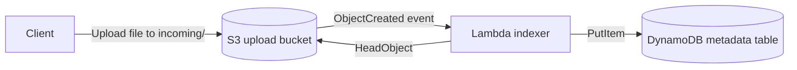

# S3 Metadata Indexing Runtime

This folder contains the Lambda source code for the S3 metadata indexing lab.

The Terraform for this lab lives in `terraform/labs/s3-metadata-indexing`. Runtime code for the Lambda function lives here in `labs/s3-metadata-indexing/lambda`.

The handler reads the uploaded object metadata and writes an item to DynamoDB for each S3 object version that lands under the configured prefix.

## Architecture



## Flow

1. Upload a file to the watched S3 prefix, such as `incoming/`.
2. S3 emits an object-created event.
3. Lambda reads the object metadata with `HeadObject`.
4. Lambda writes the metadata record to DynamoDB.

## Deployment

Copy the example variables file, adjust the region if needed, and run the standard Terraform wrapper commands from the repo root:

```powershell
Copy-Item terraform/labs/s3-metadata-indexing/terraform.tfvars.example terraform/labs/s3-metadata-indexing/terraform.tfvars
./terraform/scripts/plan.cmd -LabPath terraform/labs/s3-metadata-indexing
./terraform/scripts/apply.cmd -LabPath terraform/labs/s3-metadata-indexing
```

## Upload and Query Demo

Use the helper scripts to show the end-to-end flow:

```powershell
.\scripts\upload-sample.ps1 -BucketName <bucket> -FilePath .\sample.csv
.\scripts\query-metadata.ps1 -TableName <table> -ObjectKey incoming/sample.csv
```

The upload helper sends the file to the watched `incoming/` prefix by default and includes a small demo metadata field. The query helper fetches the indexed DynamoDB item for a specific object key and version.